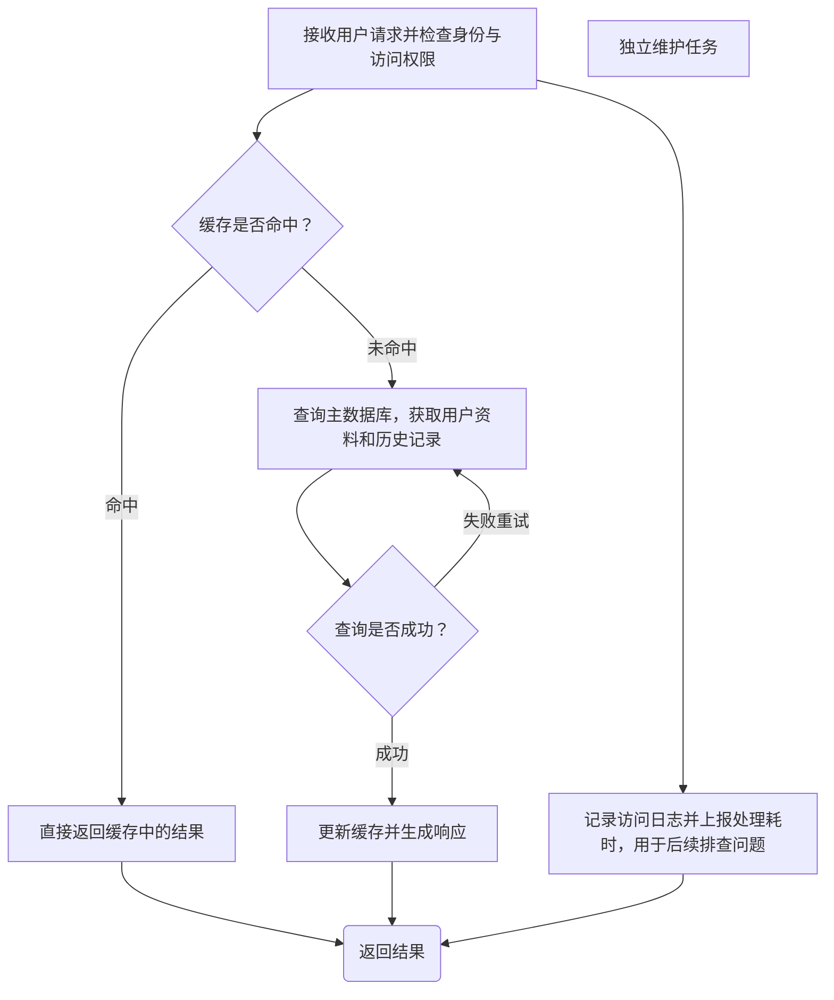

# 自动排版测试文档

用途：在项目内检查长标签、多分支、汇合、回路和独立节点的排版与连线。

```mermaid
flowchart TD
  A["接收用户请求并检查身份与访问权限"] --> B{"缓存是否命中？"}
  B -->|命中| C["直接返回缓存中的结果"]
  B -->|未命中| D["查询主数据库，获取用户资料和历史记录"]
  D --> E{"查询是否成功？"}
  E -->|成功| F["更新缓存并生成响应"]
  E -->|失败重试| D
  C --> G("返回结果")
  F --> G
  A --> H["记录访问日志并上报处理耗时，用于后续排查问题"]
  H --> G
  I["独立维护任务"]
  %% mermaid-plus: {"version":1,"node":"D","label":"查询主数据库，获取用户资料和历史记录","styles":[{"text":"主数据库","type":"highlight"}]}
```

检查：节点不重叠；连线绕过无关节点；分支文字不盖住节点；回路有独立走线；横竖方向可切换；修改布局选项不改变源码。
