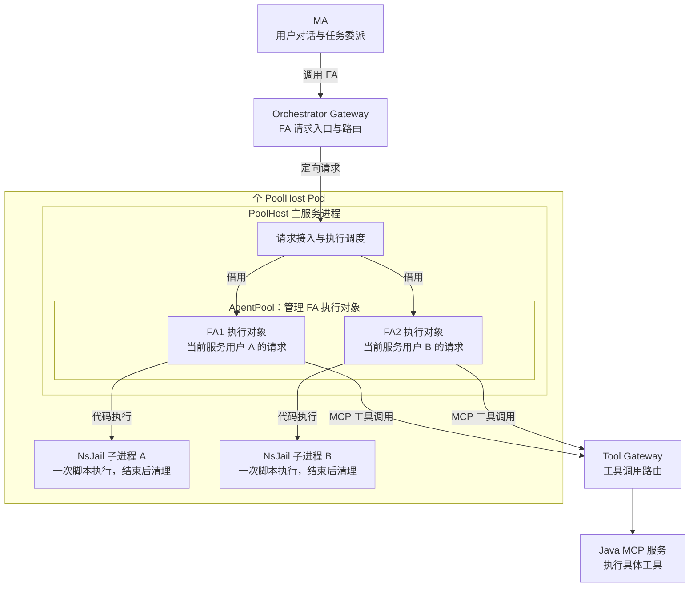

# 子图与换行标签

用途：核对嵌套子图、跨子图连线和 ` ` 换行标签能否被实验解析器读入。

```mermaid
flowchart TD
    MA["MA<br/>用户对话与任务委派"]
    OG["Orchestrator Gateway<br/>FA 请求入口与路由"]
    TG["Tool Gateway<br/>工具调用路由"]
    JAVA["Java MCP 服务<br/>执行具体工具"]

    subgraph POD_SIMPLE["一个 PoolHost Pod"]
        subgraph HOST_SIMPLE["PoolHost 主服务进程"]
            ENTRY_SIMPLE["请求接入与执行调度"]
            subgraph POOL_SIMPLE["AgentPool：管理 FA 执行对象"]
                FA1_SIMPLE["FA1 执行对象<br/>当前服务用户 A 的请求"]
                FA2_SIMPLE["FA2 执行对象<br/>当前服务用户 B 的请求"]
            end
            ENTRY_SIMPLE -->|借用| FA1_SIMPLE
            ENTRY_SIMPLE -->|借用| FA2_SIMPLE
        end
        JAIL1_SIMPLE["NsJail 子进程 A<br/>一次脚本执行，结束后清理"]
        JAIL2_SIMPLE["NsJail 子进程 B<br/>一次脚本执行，结束后清理"]
        FA1_SIMPLE -->|代码执行| JAIL1_SIMPLE
        FA2_SIMPLE -->|代码执行| JAIL2_SIMPLE
    end

    MA -->|调用 FA| OG
    OG -->|定向请求| ENTRY_SIMPLE
    FA1_SIMPLE -->|MCP 工具调用| TG
    FA2_SIMPLE -->|MCP 工具调用| TG
    TG --> JAVA
```
